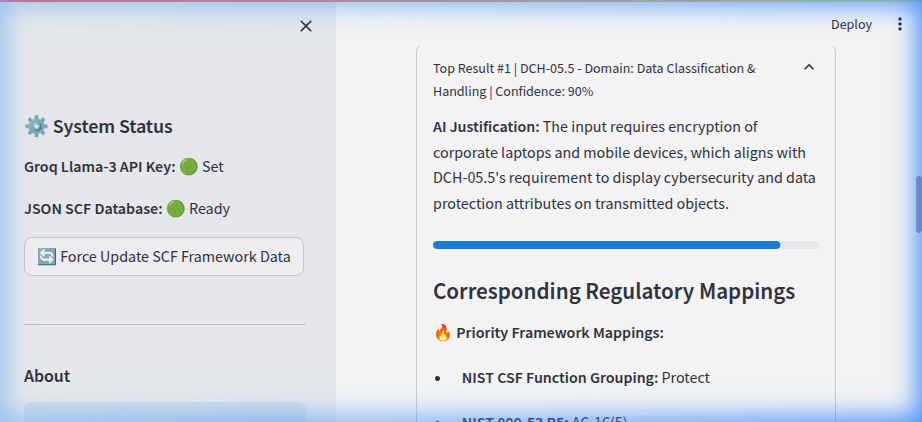
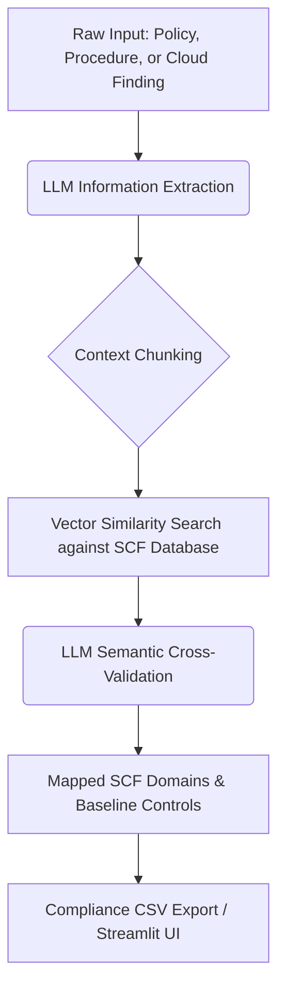

# 🛡️ SCF Auto-Crosswalker (GRC Automation / Audit Engineering)

An open-source, AI-powered internal GRC tool designed to eliminate manual spreadsheet mapping for IT Auditors and GRC Engineers.

> [!NOTE]
> **View the Complete Portfolio Case Study:** I've documented the architectural decisions, problem space, and the ROI of an AI-driven approach in **[CASE_STUDY.md](CASE_STUDY.md)**.

Simply paste a raw IT policy, a procedure, or upload a Cloud Security finding (like AWS Security Hub JSON), and the engine will autonomously map it to the **Secure Controls Framework (SCF)** and append all related compliance regulations (GDPR, SOC 2, ISO 27001, NIST, PCI).



## 📌 The GRC Assistant Suite
This project features three distinct tools and serves as the **Core Data Hub** for the ecosystem:

### 1. 🔍 SCF Auto-Crosswalker (Core Engine)
Paste a raw IT policy, a procedure, or upload a massive Cloud Security JSON (e.g. AWS Security Hub findings), and the LLM engine will autonomously map it to the absolute best matching SCF domains and controls with a confidence score.



### 2. 🎯 Audit Scope Analyzer (Prototype)
Upload a narrative Audit Scope Document (TXT/PDF) and the AI will strategically deduce which SCF Domains and specific baseline controls must be tested.
> [!TIP]
> **Looking for the full Execution Swarm?** The advanced version of this tool that actually *executes* the tests using specialized agents is now located in the **[grc-audit-swarm](https://github.com/tvobrachini/grc-audit-swarm)** repository.

### 3. 📉 Compliance Gap Analyzer
Upload a CSV listing your company's existing IT controls, select a target framework (e.g., SOC 2, HIPAA, GDPR), and instantly generate a checklist identifying exactly which baseline SCF controls are required to meet that framework.

## 🔗 Ecosystem Integration
This repository hosts the **Master SCF Control Database** (`data/scf_parsed.json`) which is utilized by the **[GRC Audit Swarm](https://github.com/tvobrachini/grc-audit-swarm)** to provide framework-grounded mappings during multi-agent audit simulations.

## 🛠️ Audit Engineering & Compliance-as-Code

This project places a heavy emphasis on "Audit Engineering," proving that GRC tools must be built with the same rigor as the production environments they assess.

- **Enterprise Containerization:** Fully Dockerized (`Dockerfile`, `docker-compose.yml`) for isolated, reproducible deployments.
- **Deterministic Builds:** Migrated to `pyproject.toml` and `uv` for blazing-fast, hash-locked dependency resolution.
- **Pytest Suite:** Structured Pydantic LLM outputs are rigorously tested in `tests/test_mapper.py` to prevent hallucinations and enforce strict JSON schemas.
- **GitHub Actions CI/CD:** A pipeline runs automatically on every push, enforcing Python linting (`ruff`), SAST security scanning (`bandit`), dependency auditing (`pip-audit`), and container build verification.

## 🔎 View the Proof of Work (No API Key Required)
You can view the exact input files (policies, AWS findings) and the resulting CSV/JSON outputs generated by the AI directly in the **[`lab_data/`](lab_data)** directory without needing to download or run the tool yourself.

## 🚀 Quickstart

1. Clone the repository and navigate to the project directory.
2. Get a FREE API Key from [Groq Console](https://console.groq.com/keys) to run Llama-3.
3. Duplicate the example environment file and add your key. **Your `.env` file is ignored by Git and will never be uploaded to GitHub.**
   ```bash
   cp .env.example .env
   # Open .env and replace "your_api_key_here" with your actual Groq key
   ```
4. Launch the application:
   ```bash
   # Option A: Enterprise Docker Deployment (Requires Docker Compose)
   docker-compose up --build -d
   # The app will be available at http://localhost:8501

   # Option B: Native Fast-Boot using uv
   uv run streamlit run app.py
   ```
   ```bash
   cp .env.example .env
   # Open .env and replace "your_api_key_here" with your actual Groq key
   ```
5. Launch the Streamlit interactive dashboard:
   ```bash
   uv run streamlit run app.py
   ```
6. *Upon first launch, click **"Force Update SCF Framework Data"** in the sidebar to securely download the latest framework into your local `data/` directory.*

## ⚖️ Licensing & Attribution
The AI mapping engine was engineered to be open-source and model-agnostic.

*The control framework data utilized by this tool is owned, maintained, and copyrighted by the [Secure Controls Framework](https://securecontrolsframework.com).* The SCF is an indispensable free resource for the cybersecurity community and is licensed under the Creative Commons Attribution-NoDerivatives 4.0 International Public License.

This project does not modify the underlying framework controls.
