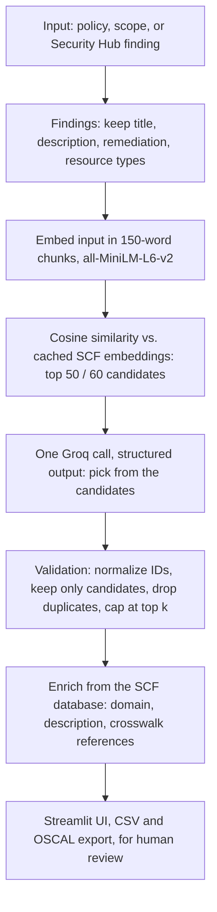

# SCF Auto-Crosswalker

[](https://github.com/tvobrachini/scf-auto-crosswalker/actions/workflows/ci.yml)
[](LICENSE)
[](pyproject.toml)

Before an auditor can test anything, they have to answer a mapping question: which control does this policy, finding or scope actually concern? With the Secure Controls Framework (SCF) that means searching more than 1,400 controls in a spreadsheet, for every new input. SCF Auto-Crosswalker is a personal project that shortens that first pass. It narrows the SCF down with embedding search, asks a language model to pick from the shortlist, and then checks every answer against that shortlist, so only real SCF controls, with SCF's own text, reach the screen. Results export to CSV and to OSCAL, and an evaluation harness scores the pipeline against AWS's and SCF's published NIST SP 800-53 mappings. The result is a set of suggestions for a person to accept or reject, not a mapping of record.

> [!IMPORTANT]
> **Disclaimer:** This is an independent, personal project developed on personal time. It is not affiliated with, sponsored by or endorsed by any current or past employer, or by the Secure Controls Framework.

Design notes: [CASE_STUDY.md](CASE_STUDY.md) (the problem, from the auditor's side) and [DECISIONS.md](DECISIONS.md) (architecture decision records).

---

## The three tools

| Tool | Input | Language model? | Output |
|---|---|---|---|
| 🔍 **SCF Auto-Crosswalker** | Policy text, a PDF/TXT document, or a Security Hub JSON export (one finding or a batch) | Yes | Up to 3 SCF controls per input, with the model's justification and self-reported confidence, and the frameworks SCF maps each control to. Batches (up to 50 distinct findings) are merged per control and ranked. CSV and OSCAL mapping export. |
| 🎯 **Audit Scope Analyzer** | An audit scope narrative (paste, TXT or PDF) | Yes | Suggested SCF domains and up to 10 SCF controls to test, with each control's SCF question and Evidence Request List reference. CSV export. |
| 📉 **Compliance Gap Analyzer** | A CSV of your controls (IDs must be SCF IDs) and a framework | No | Every SCF control that SCF's crosswalk maps to the chosen framework column, marked *Listed* or *Not listed* in your CSV (optionally counting only rows with an in-place status). CSV export. |

---

## Try it

**Fastest path, no API key: the Gap Analyzer.** It uses no language model and no embedding model; it only needs the SCF download.

```bash
git clone https://github.com/tvobrachini/scf-auto-crosswalker
cd scf-auto-crosswalker
uv sync
uv run streamlit run app.py
```

Open http://localhost:8501, click **Download / Update SCF Data** in the sidebar (it fetches the latest SCF release from GitHub into `data/`), pick **📉 Compliance Gap Analyzer**, choose a framework, and select the lab CSV. The lab list uses its own numbering on purpose, so the analyzer also shows its warning for IDs that are not SCF IDs.

**Full setup, with the model-backed tools.** Get a free [Groq API key](https://console.groq.com/keys), then:

```bash
cp .env.example .env           # set GROQ_API_KEY in .env

# Option A: Docker Compose (serves on http://127.0.0.1:8501)
docker compose up --build -d

# Option B: native, with uv (Python 3.11 to 3.13)
uv run streamlit run app.py
```

The first model-backed run downloads the embedding model (`all-MiniLM-L6-v2`, about 90 MB) from Hugging Face and embeds the SCF once; later runs load the cache. Under Compose, the SCF data and the model cache live in the `scf-data` and `model-cache` volumes; `docker compose down -v` deletes them. Every tool has a **Lab Data** picker that loads the sample inputs in [`lab_data/`](lab_data).

---

## What it looks like


*Screenshot from an earlier version of the UI (before control text came from the database). The suggestion shown, DCH-05.5 for a laptop-encryption policy, is a weak match, and it is kept here because it shows why the output needs review.*

[`lab_data/sample_outputs/`](lab_data/sample_outputs) holds raw outputs from earlier runs, and [`lab_data/README.md`](lab_data/README.md) annotates them. They record the failure modes the current validation was built for: a scope analysis that returned only NIST 800-53 IDs, and control descriptions rewritten by the model.

---

## How it works


```mermaid
graph TD
    A[Input: policy, scope, or Security Hub finding] --> B[Findings: keep title, description, remediation, resource types]
    B --> C[Embed input in 150-word chunks, all-MiniLM-L6-v2]
    C --> D[Cosine similarity vs. cached SCF embeddings: top 50 / 60 candidates]
    D --> E[One Groq call, structured output: pick from the candidates]
    E --> F[Validation: normalize IDs, keep only candidates, drop duplicates, cap at top k]
    F --> G[Enrich from the SCF database: domain, description, crosswalk references]
    G --> H[Streamlit UI, CSV and OSCAL export, for human review]
```

1. **SCF data.** `src/fetch_scf.py` downloads the latest SCF workbook from the official GitHub releases and parses the main sheet into `data/scf_parsed.json`. Both files are written atomically (temp file, then rename), and the release name is recorded for exports.
   - Each record is checked with a Pydantic schema: the ID format must be `ABC-01` or `ABC-01.1`. Weights outside 1–10 are clamped rather than dropping the control.
   - The parse keeps SCF's crosswalk columns for SOC 2, ISO 27001, NIST CSF, NIST SP 800-53, GDPR, CCPA, HIPAA and PCI DSS, matching column names regardless of spacing and line breaks.
   - A parse that keeps no valid records leaves the existing database in place.
2. **Retrieval.** Each control is embedded once. The cache stores a fingerprint of the control texts, so an SCF update rebuilds it automatically; it is written atomically, and a cache that cannot be read is rebuilt rather than failing.
   - The input is embedded in 150-word chunks and each control keeps its best chunk score. Long documents are therefore not cut off at the model's 256-token window.
   - Security Hub findings are first reduced to their title, description, remediation, resource types, severity and compliance status. Otherwise ARNs and timestamps would fill that window.
3. **One model call.** The candidates go to Groq (`llama-3.1-8b-instant` by default) through LangChain structured output.
   - The model returns only control IDs, a confidence score and a one-sentence justification. A fractional confidence (0.85) is read as a percentage.
   - The prompt tells it that the input is data to analyze, not instructions to follow.
4. **Validation and enrichment.** IDs are normalized (`" cry-01 "` → `CRY-01`). IDs that were not among the candidates, and duplicates, are dropped, and the dropped IDs are shown in the UI. At most top k are kept (3 per input; 10 for a scope). Scope domain names must be SCF domain names. Confidence is clamped to 0–100. Domain, description and crosswalk references are then copied from the database, so no control text on screen is written by the model. Model text that is shown (justifications, reasoning) is Markdown-escaped, and CSV cells that would start a spreadsheet formula are neutralized.
5. **Retries.** Groq rate limits, timeouts, connection errors and 5xx responses are retried with exponential backoff, at most 3 attempts per input (the Groq client's own retries are turned off). Authentication and bad-request errors fail at once, and a failure on one finding does not stop a batch.
6. **Batches.** Identical findings (one control failing on many resources) are sent to the model once. Batch results are ranked by Priority Score = SCF relative weight × sum of model confidences / 100, so many low-confidence hits do not outrank one confident match. Results stay on screen when you download an export.
7. **OSCAL export.** Results can be downloaded as an OSCAL 1.2 `mapping-collection` with status `draft`. Security Hub control IDs (e.g. `CloudFront.3`) become `control` sources; pasted text and documents become `statement` sources; SCF controls are the targets. Every map is recorded as `intersects-with`, the weakest positive relationship in NIST IR 8477, because the tool does not establish subset, superset or equality. The test suite parses the export with compliance-trestle's OSCAL models.

The Gap Analyzer (`src/gap_analysis.py`) is deterministic, so the same input always gives the same answer.
- It lists the SCF controls that have an entry in the chosen crosswalk column, and checks whether each control ID appears in your CSV.
- When SCF has more than one column for a framework (for example, two ISO 27001 editions), you pick one.
- IDs in your CSV that are not SCF IDs are listed, so they don't fail silently.
- If the CSV has a status column, you can count only rows with an in-place status ("Not Implemented" and "Planned" are excluded by default).

---

## What I built vs what the libraries provide

| Libraries and data provide | This project adds |
|---|---|
| **SCF:** the control catalog and its crosswalk to other frameworks | Download and parse with atomic writes and forced refresh; a workbook parser that finds the sheet and columns by name; per-record schema validation; refusing to overwrite the database with an empty parse |
| **sentence-transformers:** the embedding model | Retrieval over the SCF with a fingerprinted on-disk cache; chunked query embedding for long inputs; Security Hub (ASFF) field extraction before embedding |
| **LangChain + Groq:** prompt templates, the chat model and structured output | Model-facing schemas that ask only for decisions; validation of every returned ID against the candidates; enrichment from the database; rejected-ID reporting; a single retry layer limited to transient errors |
| **Streamlit:** the UI framework | Three tools with deduplicated, confidence-weighted batch ranking, escaped model output, lab-data pickers, a data-egress notice, and the deterministic gap analysis |
| **OSCAL, compliance-trestle:** the mapping model and its Python models | An OSCAL mapping-collection export with honest provenance (`automation`, `draft`, `intersects-with`), validated in tests with trestle; formula-safe CSV exports |
| **AWS and SCF published mappings:** Security Hub → NIST SP 800-53 and SCF → NIST SP 800-53 | An evaluation harness that builds a gold set from the two and scores retrieval and the model step |
| **pytest, Streamlit AppTest:** test runners | An offline suite with a fake chat model and a fake embedding model, CI on three Python versions, a hardened container and pinned supply chain |

---

## Security and data handling

- **Data sent to Groq.** The Crosswalker and the Scope Analyzer send the submitted text to Groq's API, and the UI says so next to the submit button. For Security Hub findings, only the extracted fields (title, description, remediation, resource types, severity, compliance status) are sent; other text and JSON is sent as submitted. The Gap Analyzer sends nothing.
- **Local only.** The app has no login. Compose publishes it on `127.0.0.1` only, and the container runs as a non-root user.
- **Model output is untrusted.** Validation guarantees that a control exists, was among the candidates, and that its text is SCF's. It does not guarantee that the control fits the input. That judgment stays with the reviewer. Model text is Markdown-escaped before display, so a prompt-injected document cannot make the page load an external image or link, and exported CSV cells cannot start a spreadsheet formula.
- **Supply chain.**
  - CI runs Bandit, `pip-audit` on the locked environment, and GitHub dependency review. Pre-commit runs detect-secrets.
  - Dependabot tracks Python packages, GitHub Actions and the Docker base image.
  - All actions are pinned to commit SHAs.
  - The AI PR-review workflow runs only for the owner, members and collaborators, and never for pull requests from forks.

See [SECURITY.md](SECURITY.md) for how to report a vulnerability and what is in scope.

---

## Configuration

Set these in `.env` (Compose and the app both read it) or in the environment.

| Variable | Purpose |
|---|---|
| `GROQ_API_KEY` | Groq API key. Required for the Crosswalker and the Scope Analyzer; not needed for the Gap Analyzer. |
| `GROQ_MODEL` | Groq model ID. Default `llama-3.1-8b-instant`. A larger model gives better choices at a higher cost and latency. |

---

## Testing and CI

```bash
uv sync
PYTHONPATH=. uv run pytest --cov=src      # offline: model, embeddings and downloads are faked
uv run pyright src/
uv run pre-commit run --all-files         # ruff, ruff-format, bandit, detect-secrets, hygiene
```

The suite needs no network access and no API keys. A bag-of-words encoder stands in for the embedding model, and a fake chat model stands in for Groq.

| Test file | What it checks |
|---|---|
| `tests/test_pipeline.py` | The full `map_text_to_scf` and `analyze_audit_scope` flows: only retrieved candidates are accepted (a real SCF control the model was not shown is rejected), top k is enforced, NIST IDs such as `AC-2` and non-SCF domains are rejected, fractional confidence, retrieval beyond the first chunk, embedding-cache rebuilds (changed SCF data, a truncated file), database reloads when the file changes, no retries on authentication errors and a single retry layer |
| `tests/test_fetch_scf.py` | Download, forced re-download, an interrupted download that leaves the previous file intact; parsing a synthetic SCF workbook, framework columns with any spacing, clamped weights, atomic writes, the release record, and an empty parse |
| `tests/test_crosswalk.py`, `tests/test_exports.py` | Batch deduplication, per-finding errors, confidence-weighted ranking; formula-safe CSV; the OSCAL mapping-collection, including a parse with compliance-trestle's OSCAL models |
| `tests/test_gap_analysis.py`, `tests/test_findings.py` | Gap matching per crosswalk column, the status filter, ID-column detection, unknown-ID reporting; Security Hub field and control-ID extraction |
| `tests/test_evaluation.py` | Gold-set construction from Security Hub and SCF mappings, the retrieval and model metrics, and the evaluation CLI end to end |
| `tests/test_app.py` | Headless Streamlit `AppTest` runs of all three tools with a fake model: single and batch crosswalks, escaping of a malicious justification, results surviving a rerun, export buttons, scope analysis and a gap analysis on the lab CSV |
| `tests/test_mapper.py`, `tests/test_validate_mapping.py` | Schemas, prompt context formatting and the validator |

GitHub Actions runs the following on every push and pull request:
- pre-commit and Pyright.
- The tests on Python 3.11, 3.12 and 3.13, with a coverage floor of 85% on `src/`.
- Bandit and `pip-audit`.
- A Docker build and a Compose config check.

---

## Evaluation

`scripts/run_eval.py` scores the pipeline against a gold set built from two published mappings, with no hand labeling: AWS's mapping of each Security Hub control to NIST SP 800-53 rev 5 (`RelatedRequirements`), and SCF's own crosswalk from its controls to NIST SP 800-53. A Security Hub control's gold SCF controls are those SCF maps to any of its 800-53 requirements.

```bash
aws securityhub describe-standards-controls --standards-subscription-arn <arn> > eval/standards_controls.json
uv run python scripts/run_eval.py --controls eval/standards_controls.json   # retrieval, no Groq key
uv run python scripts/run_eval.py --gold eval/gold.csv --llm                # plus the model step
```

It reports retrieval hit rate and mean recall at k = 10 and 50 (50 is what the model sees), and, with `--llm`, the precision of the model's suggestions. The labels are transitive, so the numbers measure consistency with AWS's and SCF's published mappings, not ground-truth accuracy. [`eval/README.md`](eval/README.md) has the details; results will be published there.

---

## Project structure

```text
app.py                          Streamlit UI for the three tools
src/
  fetch_scf.py                  Download and parse the SCF workbook; SCFControl schema
  mapper.py                     Retrieval, model calls, validation and enrichment
  findings.py                   Security Hub (ASFF) finding → text
  gap_analysis.py               Deterministic gap analysis
  crosswalk.py                  Batch runs, deduplication and ranking
  exports.py                    Formula-safe CSV and OSCAL mapping export
  evaluation.py                 Gold-set construction and metrics
  ui/components/                Sidebar and styles
scripts/run_eval.py             Build the gold set and score the pipeline
scripts/generate_mock_output.py Regenerate lab_data/sample_outputs (needs a Groq key)
eval/                           Evaluation method and results
lab_data/                       Sample inputs and annotated earlier outputs
tests/                          Offline test suite
DECISIONS.md                    Architecture decision records
```

---

## Limitations and accuracy

- **No published results yet.** The evaluation harness (see [Evaluation](#evaluation)) is in place but has not been run against the live SCF data and a Groq model, so no precision or recall figures are claimed. The earlier sample outputs include weak matches and, for the Scope Analyzer, NIST IDs instead of SCF IDs, which validation now rejects.
- **Validation proves existence, not fit.** An ID that passes validation is a real SCF control that was among the candidates. Whether it is the right control is the reviewer's call.
- **Confidence is self-reported** by the model and is not calibrated.
- **Retrieval bounds the answer.** If the right control is not among the retrieved candidates, the model cannot pick it.
- **One model call per input, whole input sent.** Very long documents can exceed Groq's context window or rate limits. Only retrieval is chunked, not the model call.
- **Gap analysis compares IDs only.** "Listed" means the SCF ID appears in your list (with an in-place status, if you use the status filter). It does not check control names, design or operating effectiveness, and it requires your list to use SCF IDs.
- **OSCAL relationships are not asserted.** Every exported map is `intersects-with` with status `draft`; a reviewer has to confirm or refine each one.
- **Framework references are SCF's.** The frameworks shown for a control come from SCF's published crosswalk, not from this tool.
- **Large image.** The locked `torch` is the default CUDA build, so the Docker image is several GB. A CPU-only torch index would shrink it.

---

## Related project

**[GRC Audit Swarm](https://github.com/tvobrachini/grc-audit-swarm)** is a separate personal project: a human-gated audit workflow in which agents draft the RACM, working papers and report. It does not read this repository's data.

---

## License and attribution

The code in this repository is released under the [MIT License](LICENSE). It does not cover SCF data.

The Secure Controls Framework is owned, maintained and copyrighted by [Secure Controls Framework](https://securecontrolsframework.com) and is licensed under the Creative Commons Attribution-NoDerivatives 4.0 International Public License. **This repository does not host SCF data.** The app downloads the official workbook from the [SCF releases](https://github.com/securecontrolsframework/securecontrolsframework/releases) and derives a local working copy in `data/`. Do not commit or redistribute that derived file: CC BY-ND 4.0 does not allow distributing modified copies. The sample CSVs in `lab_data/` quote short excerpts of SCF control text with attribution.
