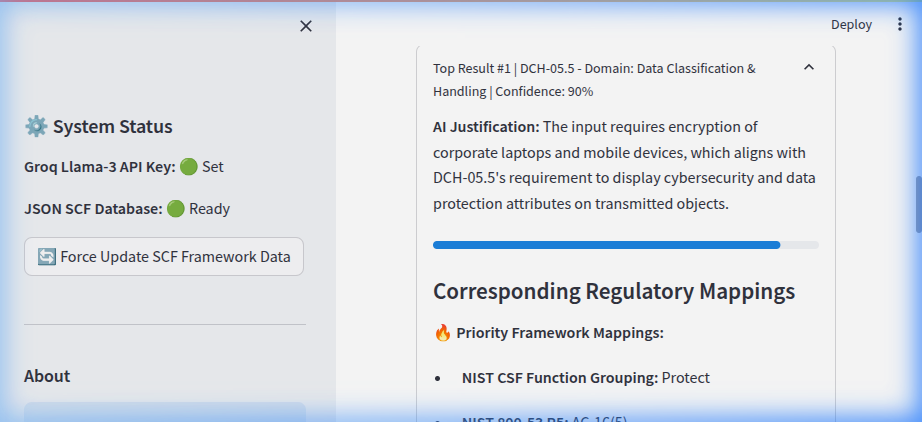
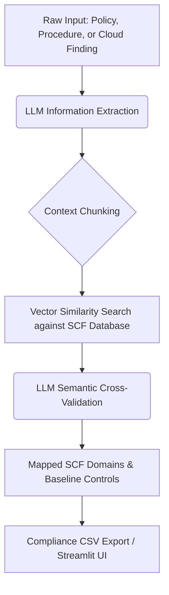

# 🛡️ SCF Auto-Crosswalker (GRC Automation / Audit Engineering)

A personal, open-source lab project (MIT-licensed code) that uses an LLM to suggest mappings from IT policies and cloud findings to Secure Controls Framework (SCF) control IDs, to reduce manual spreadsheet work for IT auditors and GRC engineers. Suggestions are for review by a person.

> [!IMPORTANT]
> **Disclaimer:** This is an independent, personal project developed on personal time. It is not affiliated with, sponsored by or endorsed by any current or past employer.

> [!NOTE]
> **View the Complete Portfolio Case Study:** I've documented the design decisions and problem space in **[CASE_STUDY.md](CASE_STUDY.md)**.

Simply paste a raw IT policy, a procedure, or upload a Cloud Security finding (like AWS Security Hub JSON), and the engine will suggest a mapping to the **Secure Controls Framework (SCF)** and list the regulations that SCF's own crosswalk links to the mapped controls (GDPR, SOC 2, ISO 27001, NIST, PCI).



## 📌 The GRC Assistant Suite
This project features three distinct tools and serves as the **Core Data Hub** for the ecosystem:

### 1. 🔍 SCF Auto-Crosswalker (Core Engine)
Paste a raw IT policy, a procedure, or upload a massive Cloud Security JSON (e.g. AWS Security Hub findings), and the LLM engine suggests the closest matching SCF domains and controls, with a confidence score, for human review.


```mermaid
graph TD
    A[Raw Input: Policy, Procedure, or Cloud Finding] --> B(LLM Information Extraction)
    B --> C{Context Chunking}
    C --> D[Vector Similarity Search against SCF Database]
    D --> E(LLM Semantic Cross-Validation)
    E --> F[Mapped SCF Domains & Baseline Controls]
    F --> G[Compliance CSV Export / Streamlit UI]
```

### 2. 🎯 Audit Scope Analyzer (Prototype)
Upload a narrative Audit Scope Document (TXT/PDF) and the AI will strategically deduce which SCF Domains and specific baseline controls must be tested.
> [!TIP]
> **Looking for the full Execution Swarm?** The advanced version of this tool that actually *executes* the tests using specialized agents is now located in the **[grc-audit-swarm](https://github.com/tvobrachini/grc-audit-swarm)** repository.

### 3. 📉 Compliance Gap Analyzer
Upload a CSV listing your company's existing IT controls, select a target framework (e.g., SOC 2, HIPAA, GDPR), and list the SCF baseline controls that SCF's own crosswalk associates with that framework, for human review.

## 🔗 Related project
The **[GRC Audit Swarm](https://github.com/tvobrachini/grc-audit-swarm)** is a separate personal project that runs audit agents. It does not read this repository's data.

## 🛠️ Audit Engineering & Compliance-as-Code

This project applies engineering practices (containerization, locked dependencies, tests, CI) to an audit-support tool.

- **Containerization:** Dockerized (`Dockerfile`, `docker-compose.yml`) for isolated, reproducible deployments.
- **Deterministic Builds:** Migrated to `pyproject.toml` and `uv` for hash-locked dependency resolution.
- **Pytest Suite:** Structured Pydantic LLM outputs are tested in `tests/test_mapper.py` to enforce strict JSON schemas. Schema validation limits malformed output; it does not prove that a mapping is correct.
- **GitHub Actions CI/CD:** A pipeline runs automatically on every push, enforcing Python linting (`ruff`), SAST security scanning (`bandit`), dependency auditing (`pip-audit`), and container build verification.

## 🔎 View the Proof of Work (No API Key Required)
You can view the exact input files (policies, AWS findings) and the resulting CSV/JSON outputs generated by the AI directly in the **[`lab_data/`](lab_data)** directory without needing to download or run the tool yourself.

## 🚀 Quickstart

1. Clone the repository and navigate to the project directory.
2. Get a FREE API Key from [Groq Console](https://console.groq.com/keys) to run Llama-3.
3. Duplicate the example environment file and add your key. **Your `.env` file is ignored by Git and will never be uploaded to GitHub.**
   ```bash
   cp .env.example .env
   # Open .env and replace "your_api_key_here" with your actual Groq key
   ```
4. Launch the application:
   ```bash
   # Option A: Docker (requires Docker Compose)
   docker-compose up --build -d
   # The app will be available at http://localhost:8501

   # Option B: Native, using uv
   uv run streamlit run app.py
   ```
5. *Upon first launch, click **"Force Update SCF Framework Data"** in the sidebar to securely download the latest framework into your local `data/` directory.*

## ⚖️ Licensing & Attribution
The code in this repository is released under the [MIT License](LICENSE). It does not cover SCF data.

*The control framework data utilized by this tool is owned, maintained, and copyrighted by the [Secure Controls Framework](https://securecontrolsframework.com).* The SCF is an indispensable free resource for the cybersecurity community and is licensed under the Creative Commons Attribution-NoDerivatives 4.0 International Public License.

**This repository does not host SCF data.** On first launch the app downloads the official workbook from the [SCF releases](https://github.com/securecontrolsframework/securecontrolsframework/releases) and derives a local working copy in `data/`, which is git-ignored. Do not commit or redistribute that derived file: CC BY-ND 4.0 does not allow distributing modified copies.
