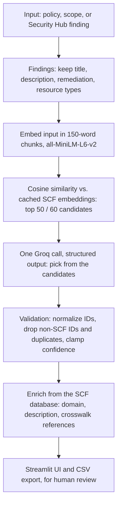

# SCF Auto-Crosswalker

[](https://github.com/tvobrachini/scf-auto-crosswalker/actions/workflows/ci.yml)
[](LICENSE)
[](pyproject.toml)

Before an auditor can test anything, they have to answer a mapping question: which control does this policy, finding or scope actually concern? With the Secure Controls Framework (SCF) that means searching more than 1,400 controls in a spreadsheet, for every new input. SCF Auto-Crosswalker is a personal project that shortens that first pass. It narrows the SCF down with embedding search, asks a language model to pick from the shortlist, and then checks every answer against the SCF database, so only real SCF controls, with SCF's own text, reach the screen. The result is a set of suggestions for a person to accept or reject, not a mapping of record.

> [!IMPORTANT]
> **Disclaimer:** This is an independent, personal project developed on personal time. It is not affiliated with, sponsored by or endorsed by any current or past employer, or by the Secure Controls Framework.

Design notes: [CASE_STUDY.md](CASE_STUDY.md) (the problem, from the auditor's side) and [DECISIONS.md](DECISIONS.md) (architecture decision records).

---

## The three tools

| Tool | Input | Language model? | Output |
|---|---|---|---|
| 🔍 **SCF Auto-Crosswalker** | Policy text, a PDF/TXT document, or a Security Hub JSON export (one finding or a batch) | Yes | Top 3 SCF controls per input, with the model's justification and self-reported confidence, and the frameworks SCF maps each control to. Batches are merged per control and ranked. CSV export. |
| 🎯 **Audit Scope Analyzer** | An audit scope narrative (paste, TXT or PDF) | Yes | Suggested SCF domains and 5–10 SCF controls to test, with each control's SCF question and Evidence Request List reference. CSV export. |
| 📉 **Compliance Gap Analyzer** | A CSV of your controls (IDs must be SCF IDs) and a framework | No | Every SCF control that SCF's crosswalk maps to the chosen framework column, marked *Listed* or *Not listed* in your CSV. CSV export. |

---

## Try it

**Fastest path, no API key: the Gap Analyzer.** It uses no language model and no embedding model; it only needs the SCF download.

```bash
git clone https://github.com/tvobrachini/scf-auto-crosswalker
cd scf-auto-crosswalker
uv sync
uv run streamlit run app.py
```

Open http://localhost:8501, click **Download / Update SCF Data** in the sidebar (it fetches the latest SCF release from GitHub into `data/`), pick **📉 Compliance Gap Analyzer**, choose a framework, and select the lab CSV. The lab list uses its own numbering on purpose, so the analyzer also shows its warning for IDs that are not SCF IDs.

**Full setup, with the model-backed tools.** Get a free [Groq API key](https://console.groq.com/keys), then:

```bash
cp .env.example .env           # set GROQ_API_KEY in .env

# Option A: Docker Compose (serves on http://127.0.0.1:8501)
docker compose up --build -d

# Option B: native, with uv (Python 3.11 to 3.13)
uv run streamlit run app.py
```

The first model-backed run downloads the embedding model (`all-MiniLM-L6-v2`, about 90 MB) from Hugging Face and embeds the SCF once; later runs load the cache. Under Compose, the SCF data and the model cache live in the `scf-data` and `model-cache` volumes; `docker compose down -v` deletes them. Every tool has a **Lab Data** picker that loads the sample inputs in [`lab_data/`](lab_data).

---

## What it looks like


*Screenshot from an earlier version of the UI (before control text came from the database). The suggestion shown, DCH-05.5 for a laptop-encryption policy, is a weak match, and it is kept here because it shows why the output needs review.*

[`lab_data/sample_outputs/`](lab_data/sample_outputs) holds raw outputs from earlier runs, and [`lab_data/README.md`](lab_data/README.md) annotates them. They record the failure modes the current validation was built for: a scope analysis that returned only NIST 800-53 IDs, and control descriptions rewritten by the model.

---

## How it works


```mermaid
graph TD
    A[Input: policy, scope, or Security Hub finding] --> B[Findings: keep title, description, remediation, resource types]
    B --> C[Embed input in 150-word chunks, all-MiniLM-L6-v2]
    C --> D[Cosine similarity vs. cached SCF embeddings: top 50 / 60 candidates]
    D --> E[One Groq call, structured output: pick from the candidates]
    E --> F[Validation: normalize IDs, drop non-SCF IDs and duplicates, clamp confidence]
    F --> G[Enrich from the SCF database: domain, description, crosswalk references]
    G --> H[Streamlit UI and CSV export, for human review]
```

1. **SCF data.** `src/fetch_scf.py` downloads the latest SCF workbook from the official GitHub releases, writes it atomically, and parses the main sheet into `data/scf_parsed.json`.
   - Each record is checked with a Pydantic schema: the ID format must be `ABC-01` or `ABC-01.1`, and the weight must be 1–10.
   - The parse keeps SCF's crosswalk columns for SOC 2, ISO 27001, NIST CSF, NIST 800-53, GDPR, CCPA, HIPAA and PCI DSS.
   - A parse that keeps no valid records leaves the existing database in place.
2. **Retrieval.** Each control is embedded once, and the cache stores a fingerprint of the control texts, so an SCF update rebuilds it automatically.
   - The input is embedded in 150-word chunks and each control keeps its best chunk score. Long documents are therefore not cut off at the model's 256-token window.
   - Security Hub findings are first reduced to their title, description, remediation, resource types, severity and compliance status. Otherwise ARNs and timestamps would fill that window.
3. **One model call.** The candidates go to Groq (`llama-3.1-8b-instant` by default) through LangChain structured output.
   - The model returns only control IDs, a confidence score and a one-sentence justification.
   - The prompt tells it that the input is data to analyze, not instructions to follow.
4. **Validation and enrichment.** IDs are normalized (`" cry-01 "` → `CRY-01`). IDs that are not in the SCF database, and duplicates, are dropped, and the dropped IDs are shown in the UI. Confidence is clamped to 0–100. Domain, description and crosswalk references are then copied from the database, so no control text on screen is written by the model.
5. **Retries.** Groq rate limits, timeouts, connection errors and 5xx responses are retried up to three times with exponential backoff. Authentication and bad-request errors fail at once.

The Gap Analyzer (`src/gap_analysis.py`) is deterministic, so the same input always gives the same answer.
- It lists the SCF controls that have an entry in the chosen crosswalk column, and checks whether each control ID appears in your CSV.
- When SCF has more than one column for a framework (for example, two ISO 27001 editions), you pick one.
- IDs in your CSV that are not SCF IDs are listed, so they don't fail silently.

---

## What I built vs what the libraries provide

| Libraries and data provide | This project adds |
|---|---|
| **SCF:** the control catalog and its crosswalk to other frameworks | Download with atomic write and forced refresh; a workbook parser that finds the sheet and columns by name; per-record schema validation; refusing to overwrite the database with an empty parse |
| **sentence-transformers:** the embedding model | Retrieval over the SCF with a fingerprinted on-disk cache; chunked query embedding for long inputs; Security Hub (ASFF) field extraction before embedding |
| **LangChain + Groq:** prompt templates, the chat model and structured output | Model-facing schemas that ask only for decisions; validation of every returned ID against the SCF database; enrichment from the database; rejected-ID reporting; retries limited to transient errors |
| **Streamlit:** the UI framework | Three tools with batch aggregation (SCF weight × hit count), CSV exports, lab-data pickers, a data-egress notice, and the deterministic gap analysis |
| **pytest, Streamlit AppTest:** test runners | An offline suite with a fake chat model and a fake embedding model, CI on three Python versions, a hardened container and pinned supply chain |

---

## Security and data handling

- **Data sent to Groq.** The Crosswalker and the Scope Analyzer send the submitted text to Groq's API, and the UI says so next to the submit button. For Security Hub findings, only the extracted fields are sent. The Gap Analyzer sends nothing.
- **Local only.** The app has no login. Compose publishes it on `127.0.0.1` only, and the container runs as a non-root user.
- **Model output is untrusted.** Validation guarantees that a control exists and that its text is SCF's. It does not guarantee that the control fits the input. That judgment stays with the reviewer.
- **Supply chain.**
  - CI runs Bandit, `pip-audit` on the locked environment, and GitHub dependency review. Pre-commit runs detect-secrets.
  - Dependabot tracks Python packages, GitHub Actions and the Docker base image.
  - All actions are pinned to commit SHAs.
  - The AI PR-review workflow runs only for the owner, members and collaborators, and never for pull requests from forks.

See [SECURITY.md](SECURITY.md) for how to report a vulnerability and what is in scope.

---

## Configuration

Set these in `.env` (Compose and the app both read it) or in the environment.

| Variable | Purpose |
|---|---|
| `GROQ_API_KEY` | Groq API key. Required for the Crosswalker and the Scope Analyzer; not needed for the Gap Analyzer. |
| `GROQ_MODEL` | Groq model ID. Default `llama-3.1-8b-instant`. A larger model gives better choices at a higher cost and latency. |

The **AI Persona Lens** in the sidebar adds a reviewer perspective to the Crosswalker's system prompt: a PCI DSS QSA, a FedRAMP 3PAO, or a GDPR DPO.

---

## Testing and CI

```bash
uv sync
PYTHONPATH=. uv run pytest --cov=src      # offline: model, embeddings and downloads are faked
uv run pyright src/
uv run pre-commit run --all-files         # ruff, ruff-format, bandit, detect-secrets, hygiene
```

The suite needs no network access and no API keys. A bag-of-words encoder stands in for the embedding model, and a fake chat model stands in for Groq.

| Test file | What it checks |
|---|---|
| `tests/test_pipeline.py` | The full `map_text_to_scf` and `analyze_audit_scope` flows: control text from the database, rejection of non-SCF IDs such as NIST's `AC-2`, normalization and deduplication, escaped braces in the persona prompt, retrieval beyond the first chunk, embedding-cache rebuilds when the SCF changes, no retries on authentication errors |
| `tests/test_fetch_scf.py` | Download, forced re-download, an interrupted download that leaves the previous file intact; parsing a synthetic SCF workbook, a sheet without a domain column, and an empty parse |
| `tests/test_gap_analysis.py`, `tests/test_findings.py` | Gap matching per crosswalk column, unknown-ID reporting, Security Hub field extraction |
| `tests/test_app.py` | Headless Streamlit `AppTest` runs of all three tools, including a gap analysis on the lab CSV |
| `tests/test_mapper.py`, `tests/test_validate_mapping.py` | Schemas, prompt context formatting and the validator |

GitHub Actions runs the following on every push and pull request:
- pre-commit and Pyright.
- The tests on Python 3.11, 3.12 and 3.13, with a coverage floor of 80% on `src/`.
- Bandit and `pip-audit`.
- A Docker build and a Compose config check.

---

## Project structure

```text
app.py                          Streamlit UI for the three tools
src/
  fetch_scf.py                  Download and parse the SCF workbook; SCFControl schema
  mapper.py                     Retrieval, model calls, validation and enrichment
  findings.py                   Security Hub (ASFF) finding → text
  gap_analysis.py               Deterministic gap analysis
  ui/components/                Sidebar and styles
scripts/generate_mock_output.py Regenerate lab_data/sample_outputs (needs a Groq key)
lab_data/                       Sample inputs and annotated earlier outputs
tests/                          Offline test suite
DECISIONS.md                    Architecture decision records
```

---

## Limitations and accuracy

- **Not benchmarked.** There are no measured figures for mapping precision or recall, and none are claimed. The earlier sample outputs include weak matches and, for the Scope Analyzer, NIST IDs instead of SCF IDs, which validation now rejects.
- **Validation proves existence, not fit.** An ID that passes validation is a real SCF control. Whether it is the right control is the reviewer's call.
- **Confidence is self-reported** by the model and is not calibrated.
- **Retrieval bounds the answer.** If the right control is not among the retrieved candidates, the model cannot pick it.
- **One model call per input, whole input sent.** Very long documents can exceed Groq's context window or rate limits. Only retrieval is chunked, not the model call.
- **Gap analysis compares IDs only.** "Listed" means the SCF ID appears in your list. It does not check control names, design or operating effectiveness, and it requires your list to use SCF IDs.
- **Framework references are SCF's.** The frameworks shown for a control come from SCF's published crosswalk, not from this tool.
- **Large image.** The locked `torch` is the default CUDA build, so the Docker image is several GB. A CPU-only torch index would shrink it.

---

## Related project

**[GRC Audit Swarm](https://github.com/tvobrachini/grc-audit-swarm)** is a separate personal project: a human-gated audit workflow in which agents draft the RACM, working papers and report. It does not read this repository's data.

---

## License and attribution

The code in this repository is released under the [MIT License](LICENSE). It does not cover SCF data.

The Secure Controls Framework is owned, maintained and copyrighted by [Secure Controls Framework](https://securecontrolsframework.com) and is licensed under the Creative Commons Attribution-NoDerivatives 4.0 International Public License. **This repository does not host SCF data.** The app downloads the official workbook from the [SCF releases](https://github.com/securecontrolsframework/securecontrolsframework/releases) and derives a local working copy in `data/`. Do not commit or redistribute that derived file: CC BY-ND 4.0 does not allow distributing modified copies. The sample CSVs in `lab_data/` quote short excerpts of SCF control text with attribution.
