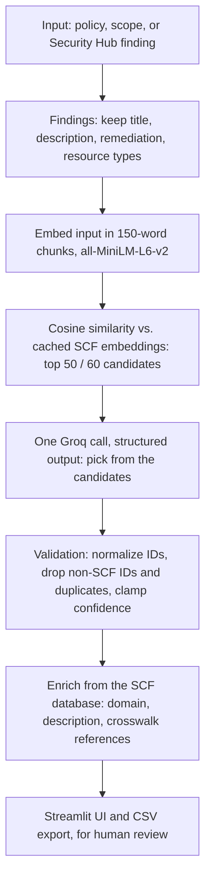

# SCF Auto-Crosswalker

[](https://github.com/tvobrachini/scf-auto-crosswalker/actions/workflows/ci.yml)
[](LICENSE)

A personal, open-source lab project that suggests which [Secure Controls Framework (SCF)](https://securecontrolsframework.com) controls match an IT policy, an audit scope or an AWS Security Hub finding. It combines embedding-based retrieval, one LLM call, and a validation step that only lets real SCF controls through. Every suggestion is meant to be reviewed by a person.

> [!IMPORTANT]
> **Disclaimer:** This is an independent, personal project developed on personal time. It is not affiliated with, sponsored by or endorsed by any current or past employer, or by the Secure Controls Framework.

- **Design decisions:** [DECISIONS.md](DECISIONS.md)
- **Problem and approach, from the auditor's side:** [CASE_STUDY.md](CASE_STUDY.md)


*Screenshot from an earlier version of the UI. The suggestion shown (DCH-05.5 for a laptop-encryption policy) is a weak match. It is kept because it shows why the output needs review.*

## The three tools

| Tool | Input | Uses the LLM? | Output |
|---|---|---|---|
| 🔍 **SCF Auto-Crosswalker** | Policy text, a PDF/TXT document, or a Security Hub JSON export (one finding or a batch) | Yes | Top 3 SCF controls per input, with the model's justification and self-reported confidence, plus the frameworks SCF maps each control to. Batches are merged per control and ranked. CSV export. |
| 🎯 **Audit Scope Analyzer** | An audit scope narrative (paste, TXT or PDF) | Yes | Suggested SCF domains and 5–10 SCF controls to test, with each control's SCF question and Evidence Request List reference. CSV export. |
| 📉 **Compliance Gap Analyzer** | A CSV of your controls (IDs must be SCF IDs) and a framework | No | Every SCF control that SCF's crosswalk maps to the chosen framework column, marked *Listed* or *Not listed* in your CSV. CSV export. |

## How it works


```mermaid
graph TD
    A[Input: policy, scope, or Security Hub finding] --> B[Findings: keep title, description, remediation, resource types]
    B --> C[Embed input in 150-word chunks, all-MiniLM-L6-v2]
    C --> D[Cosine similarity vs. cached SCF embeddings: top 50 / 60 candidates]
    D --> E[One Groq call, structured output: pick from the candidates]
    E --> F[Validation: normalize IDs, drop non-SCF IDs and duplicates, clamp confidence]
    F --> G[Enrich from the SCF database: domain, description, crosswalk references]
    G --> H[Streamlit UI and CSV export, for human review]
```

1. **SCF data.** On first use, `src/fetch_scf.py` downloads the latest SCF workbook from the official GitHub releases, writes it atomically, and parses the main sheet into `data/scf_parsed.json`. Each record is checked with a Pydantic schema (ID format `ABC-01` or `ABC-01.1`, weight 1–10). The parse keeps the crosswalk columns for SOC 2, ISO 27001, NIST CSF, NIST 800-53, GDPR, CCPA, HIPAA and PCI DSS. If no record passes validation, the existing database is kept.
2. **Retrieval.** Every control is embedded once with `all-MiniLM-L6-v2`. The cache (`data/scf_embeddings.npz`) stores a fingerprint of the control texts and is rebuilt automatically when the SCF data changes. The input is embedded in 150-word chunks and each control keeps its best chunk score, so long documents are not cut off at the model's 256-token window. Security Hub findings are reduced to their title, description, remediation, resource types, severity and compliance status first, since ARNs and timestamps would otherwise fill that window.
3. **One LLM call.** The candidates go to Groq (`llama-3.1-8b-instant` by default) through LangChain structured output. The model is asked only for control IDs, a confidence score and a one-sentence justification. The prompt tells it that the input is data, not instructions.
4. **Validation.** `_validate_mapping_result` and `_validate_scope_recommendation` normalize IDs (`" cry-01 "` → `CRY-01`), drop IDs that are not in the SCF database and duplicates, and clamp confidence to 0–100. Dropped IDs are shown in the UI. Domain, description and crosswalk references are then copied from the SCF database, so no control text shown to the user is written by the model.
5. **Retries.** Groq rate limits, timeouts, connection errors and 5xx responses are retried up to 3 times with exponential backoff. Authentication and bad-request errors are raised immediately.

The Gap Analyzer (`src/gap_analysis.py`) is deterministic. It finds the SCF controls that have an entry in the chosen crosswalk column and checks whether each control ID appears in your CSV. When SCF has more than one column for a framework (for example, two ISO 27001 editions), you pick one. IDs in your CSV that are not SCF IDs are listed so they don't fail silently.

## Try it

You need a free [Groq API key](https://console.groq.com/keys) for the Crosswalker and the Scope Analyzer. The Gap Analyzer works without one. The first run downloads the SCF workbook from GitHub and the embedding model (about 90 MB) from Hugging Face.

```bash
cp .env.example .env           # then set GROQ_API_KEY in .env

# Option A: Docker (serves on http://127.0.0.1:8501)
docker compose up --build -d

# Option B: native, with uv (Python 3.11 or 3.12)
uv sync
uv run streamlit run app.py
```

Then click **Download / Update SCF Data** in the sidebar once. It fetches the latest SCF release into `data/` (git-ignored, and a named volume under Docker).

The **Lab Data** pickers in each tool load the sample inputs in [`lab_data/`](lab_data). [`lab_data/README.md`](lab_data/README.md) describes them and the raw outputs from earlier runs, including the failure modes those outputs show.

## Security and data handling

- The Crosswalker and the Scope Analyzer send the submitted text to Groq. The UI says so next to the submit button. The Gap Analyzer sends nothing.
- The container runs as a non-root user and publishes its port on `127.0.0.1` only. The app has no login.
- CI runs Bandit, `pip-audit` on the locked environment, and GitHub dependency review. Dependabot tracks Python packages, GitHub Actions and the Docker base image. All actions are pinned to commit SHAs, and pre-commit runs detect-secrets.
- The AI PR-review workflow only runs for the repository owner, members and collaborators, and never for pull requests from forks.

See [SECURITY.md](SECURITY.md) for reporting and scope.

## Testing and CI

```bash
PYTHONPATH=. uv run pytest --cov=src      # offline: LLM, embeddings and downloads are faked
uv run pyright src/
uv run pre-commit run --all-files         # ruff, ruff-format, bandit, detect-secrets, hygiene
```

The suite runs without network access or API keys. It uses a bag-of-words fake in place of the embedding model and a fake chat model in place of Groq.

- **`tests/test_pipeline.py`:** the full `map_text_to_scf` and `analyze_audit_scope` flows.
  - Control text comes from the database.
  - Non-SCF IDs such as NIST's `AC-2` are rejected.
  - IDs are normalized and deduplicated.
  - Braces in the persona prompt are escaped.
  - Retrieval finds text beyond the first chunk.
  - The embedding cache is rebuilt when the SCF data changes.
  - Authentication errors are not retried.
- **`tests/test_fetch_scf.py`:**
  - Download, forced re-download, and an interrupted download that leaves the previous file intact.
  - Parsing a synthetic SCF workbook, a sheet without a domain column, and a parse that refuses to write an empty database.
- **`tests/test_gap_analysis.py`** and **`tests/test_findings.py`:** gap matching and Security Hub field extraction.
- **`tests/test_app.py`:** headless Streamlit `AppTest` runs of all three tools, including a gap analysis on the lab CSV.

GitHub Actions runs pre-commit, Pyright, the tests on Python 3.11 and 3.12 (with a coverage floor of 80% on `src/`), Bandit, `pip-audit`, and a Docker build.

## Project structure

```text
app.py                     Streamlit UI for the three tools
src/
  fetch_scf.py             Download and parse the SCF workbook; SCFControl schema
  mapper.py                Retrieval, LLM calls, validation and enrichment
  findings.py              Security Hub (ASFF) finding → text
  gap_analysis.py          Deterministic gap analysis
  ui/components/           Sidebar and styles
scripts/generate_mock_output.py   Regenerate lab_data/sample_outputs
lab_data/                  Sample inputs and earlier raw outputs
tests/                     Offline test suite
```

## Limitations and accuracy

- **Not benchmarked.** There are no measured figures for mapping precision or recall, and none are claimed. The earlier sample outputs in `lab_data/` include weak matches and, for the Scope Analyzer, NIST IDs instead of SCF IDs, which validation now rejects.
- **Validation proves existence, not fit.** An ID that passes validation is a real SCF control. Whether it is the *right* control is still the reviewer's call.
- **Confidence is self-reported** by the model and is not calibrated.
- **Retrieval bounds the answer.** If the right control is not among the retrieved candidates, the model cannot pick it.
- **One LLM call per input, whole input sent.** Very long documents can exceed Groq's context window or rate limits; there is no document-level chunking of the LLM call.
- **Gap analysis compares IDs only.** "Listed" says the SCF ID appears in your list. It does not check control names, design or operating effectiveness, and it requires your list to use SCF IDs.
- **Framework references are SCF's.** The frameworks shown for a control come from SCF's own published crosswalk, not from this tool.
- **Large image.** The locked `torch` is the default CUDA build, so the Docker image is several GB. A CPU-only torch index would shrink it.

## Related project

**[GRC Audit Swarm](https://github.com/tvobrachini/grc-audit-swarm)** is a separate personal project: a human-gated audit workflow run by agents. It does not read this repository's data.

## Licensing and attribution

The code in this repository is released under the [MIT License](LICENSE). It does not cover SCF data.

The Secure Controls Framework is owned, maintained and copyrighted by [Secure Controls Framework](https://securecontrolsframework.com) and is licensed under the Creative Commons Attribution-NoDerivatives 4.0 International Public License. **This repository does not host SCF data.** The app downloads the official workbook from the [SCF releases](https://github.com/securecontrolsframework/securecontrolsframework/releases) and derives a local working copy in `data/`. Do not commit or redistribute that derived file: CC BY-ND 4.0 does not allow distributing modified copies. The sample CSVs in `lab_data/` quote short excerpts of SCF control text with attribution.
