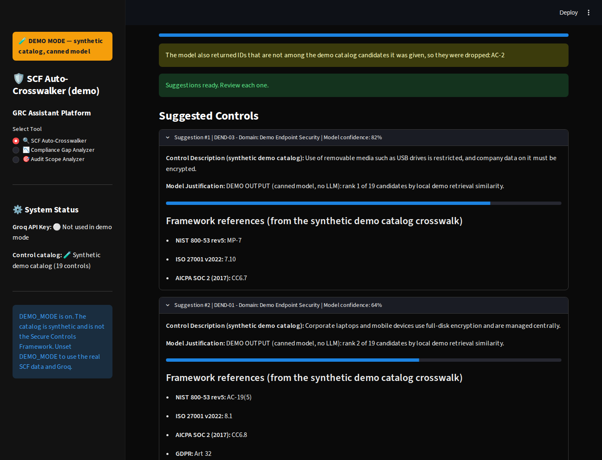
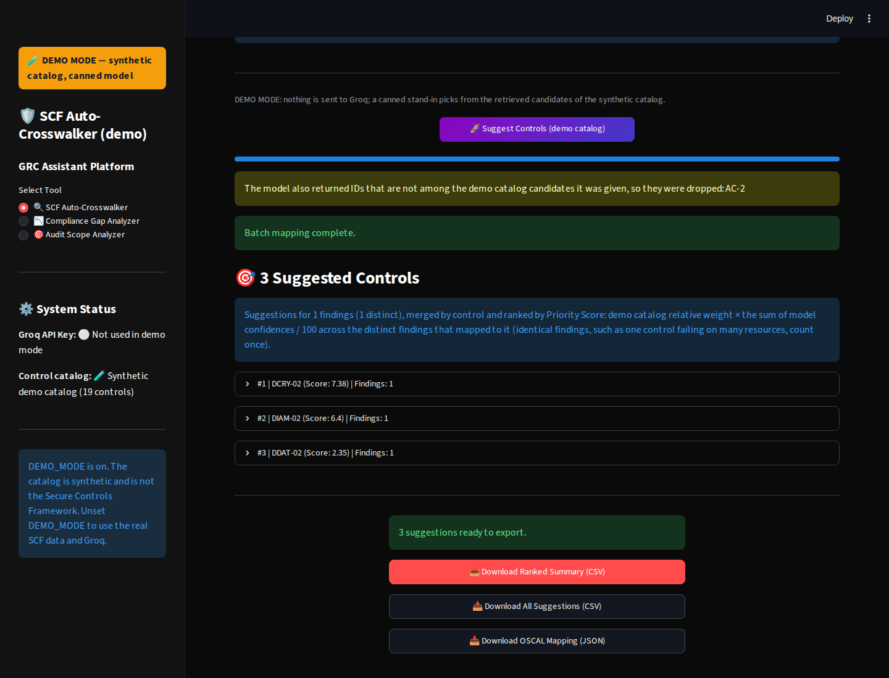
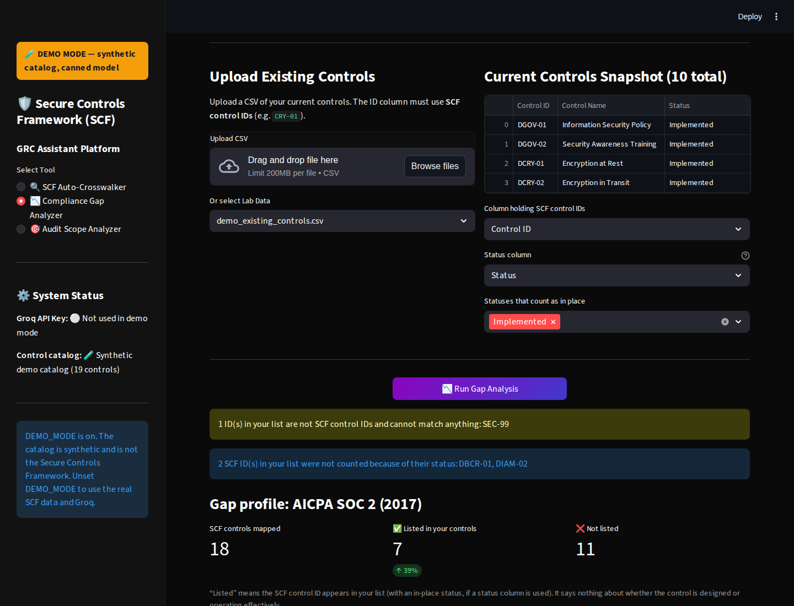
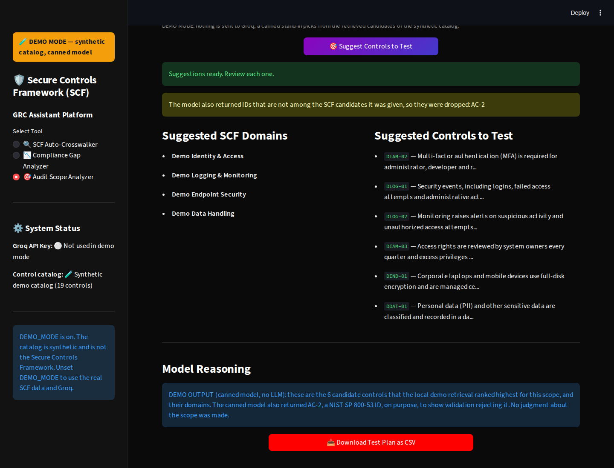
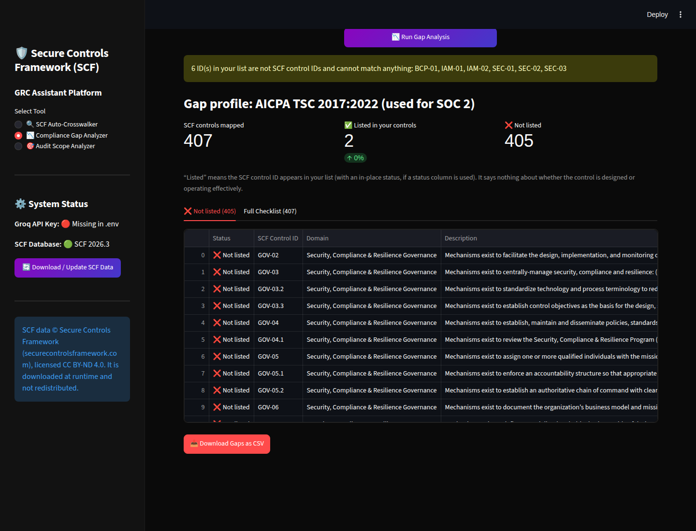
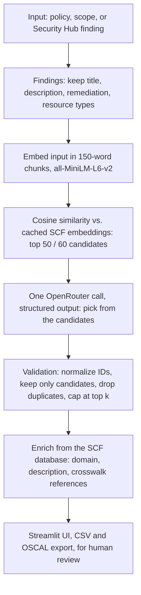

# SCF Auto-Crosswalker

[](https://github.com/tvobrachini/scf-auto-crosswalker/actions/workflows/ci.yml)
[](LICENSE)
[](pyproject.toml)

Before an auditor can test anything, they have to answer a mapping question: which control does this policy, finding or scope actually concern? With the Secure Controls Framework (SCF) that means searching 1,591 controls (release 2026.3) in a spreadsheet, for every new input. SCF Auto-Crosswalker is a personal project that shortens that first pass.

- **How it works.** Embedding search narrows the SCF to a shortlist, a language model picks from it, and every answer is checked against the shortlist, so only real SCF controls, with SCF's own text, reach the screen. Results export to CSV and OSCAL.
- **How well the search works.** For 221 AWS Security Hub control definitions, the shortlist of 50 contains an SCF control that AWS's and SCF's published NIST SP 800-53 mappings link to it in 62% of cases (keyword search: 46%; chance: 23%). That is a ceiling on what the model can get right, not an accuracy figure; the model's own picks have not been scored yet ([Evaluation](#evaluation)).
- **Gap analysis without a model.** A control list is checked against a framework per requirement: with the sample list on SCF 2026.3, 8 of the 61 SOC 2 criteria SCF maps to have a control the list marks as implemented.

The result is a set of suggestions for a person to accept or reject, not a mapping of record.

> [!IMPORTANT]
> **Disclaimer:** This is an independent, personal project developed on personal time. It is not affiliated with, sponsored by or endorsed by any current or past employer, or by the Secure Controls Framework.

Design notes: [CASE_STUDY.md](CASE_STUDY.md) (the problem, from the auditor's side) and [DECISIONS.md](DECISIONS.md) (architecture decision records). Changes: [CHANGELOG.md](CHANGELOG.md). Contributing: [CONTRIBUTING.md](CONTRIBUTING.md).

---

## Try it in 2 minutes (no API keys)

`DEMO_MODE=1` runs all three tools with no OpenRouter key and without calling OpenRouter, Hugging Face or the SCF download (Streamlit's own usage statistics are also turned off, in `.streamlit/config.toml`). Two things are swapped out: the SCF data is replaced by a small synthetic catalog (19 made-up controls with IDs such as `DCRY-01`), and the language model is replaced by a canned stand-in that picks the top retrieved candidates. Everything else runs for real on that data: retrieval ranking, validation, enrichment from the catalog, batch deduplication and ranking, the gap analysis, and the CSV and OSCAL exports. Every page shows a **DEMO MODE** badge, and every export is stamped as demo data.

**With Docker Compose** (serves on http://127.0.0.1:8501)

```bash
git clone https://github.com/tvobrachini/scf-auto-crosswalker
cd scf-auto-crosswalker
DEMO_MODE=1 docker compose up --build
```

Or put `DEMO_MODE=1` in `.env` (see [`.env.example`](.env.example)) and run `docker compose up --build`.

**Without Docker** (Python 3.11 to 3.13, with [uv](https://docs.astral.sh/uv/))

```bash
uv sync
DEMO_MODE=1 uv run streamlit run app.py
```

Then pick a tool and a **Lab Data** sample: `sample_endpoint_policy.txt` or `aws_securityhub_finding.json` in the Crosswalker, `demo_existing_controls.csv` in the Gap Analyzer, `sample_audit_scope.txt` in the Scope Analyzer.

What the demo does **not** show: how good the real suggestions are. The catalog is not the SCF, the embedder is a hashed bag of words rather than `all-MiniLM-L6-v2`, and the canned model makes no judgment. For the Crosswalker it always returns the top three candidates with fixed confidences (82, 64, 47), and for a scope the top six; both also return `AC-2`, a NIST SP 800-53 ID, on purpose, so you can see validation reject an ID that was not among the candidates. See [ADR-010](DECISIONS.md#adr-010-a-demo-mode-with-a-synthetic-catalog-and-a-canned-model). Demo mode is refused when `ENVIRONMENT` is `production` or `staging`.

---

## What it looks like

All screenshots below are from a `DEMO_MODE=1` run: the catalog is synthetic (not SCF content) and the suggestions come from the canned stand-in, not a language model. The DEMO MODE badge is visible in the sidebar of every screen. Regenerate them with [`scripts/capture_screenshots.mjs`](scripts/capture_screenshots.mjs).

<table>
<tr>
<td width="50%">



Crosswalker on the lab endpoint policy: the suggestions, with control text and crosswalk references taken from the catalog, and the warning that the planted `AC-2` was not a candidate and was dropped.

</td>
<td width="50%">



Crosswalker in batch mode on the lab Security Hub export: controls ranked by Priority Score, with the ranked-summary CSV, all-suggestions CSV and OSCAL mapping exports.

</td>
</tr>
<tr>
<td width="50%">



Gap Analyzer on `demo_existing_controls.csv` against the SOC 2 column: an ID that is not a catalog ID, two IDs not counted because of their status, then coverage per SOC 2 criterion (7 of 14 have a listed control) and per catalog control, with the per-criterion table.

</td>
<td width="50%">



Audit Scope Analyzer on the lab scope: suggested domains and controls to test, the rejected `AC-2`, and the canned reasoning, which says it is demo output.

</td>
</tr>
</table>

**And on real data.** The Gap Analyzer needs no language model, so it can run against the real SCF release without an OpenRouter key. This is SCF 2026.3 (1,591 controls, from the official SCF repository) against the SOC 2 column, for `lab_data/sample_controls_with_scf_mapping.csv`, a control list with its own numbering and a column mapping each control to SCF IDs:



SCF cites 61 SOC 2 criteria across all five categories (33 of them in Security, the common criteria many SOC 2 reports are scoped to); 8 have at least one SCF control the sample lists as implemented. Counted by SCF control instead, 6 of the 407 mapped controls are listed, which is why the report leads with requirements. The analyzer picked the `SCF Mapping` column because it names the most SCF IDs, and three mapped controls are not counted because their rows are "Partially implemented" or "Planned". Captured with `MODE=real node scripts/capture_screenshots.mjs`. The table shows framework references and SCF control IDs only, no SCF control text. SCF © Secure Controls Framework (securecontrolsframework.com), CC BY-ND 4.0. The SCF data itself is not stored in this repository.

[`lab_data/sample_outputs/`](lab_data/sample_outputs) holds raw outputs from earlier runs with the real SCF and Groq's `llama-3.1-8b-instant` (before the switch to OpenRouter), and [`lab_data/README.md`](lab_data/README.md) annotates them. They record the failure modes the current validation was built for: a scope analysis that returned only NIST 800-53 IDs, and control descriptions rewritten by the model.

---

## The three tools

| Tool | Input | Language model? | Output |
|---|---|---|---|
| 🔍 **SCF Auto-Crosswalker** | Policy text, a PDF/TXT document, or a Security Hub JSON export (one finding or a batch) | Yes | Up to 3 SCF controls per input, with the model's justification and self-reported confidence, and the frameworks SCF maps each control to. Batches (up to 50 distinct findings) are merged per control and ranked. CSV and OSCAL mapping export. |
| 🎯 **Audit Scope Analyzer** | An audit scope narrative (paste, TXT or PDF) | Yes | Suggested SCF domains and up to 10 SCF controls to test, with each control's SCF question and Evidence Request List reference. CSV export. |
| 📉 **Compliance Gap Analyzer** | A CSV of your controls, with SCF IDs or a column mapping them to SCF IDs, and a framework | No | Each framework requirement SCF maps controls to, with or without a listed control, and every mapped SCF control marked *Listed* or *Not listed* (optionally counting only rows with an in-place status). CSV export. |

---

## Run it with the real SCF data

**No API key: the Gap Analyzer.** It uses no language model and no embedding model; it only needs the SCF download.

```bash
git clone https://github.com/tvobrachini/scf-auto-crosswalker
cd scf-auto-crosswalker
uv sync
uv run streamlit run app.py
```

Open http://localhost:8501, click **Download / Update SCF Data** in the sidebar (it fetches the latest SCF release from GitHub into `data/`), pick **📉 Compliance Gap Analyzer**, choose a framework, and select `sample_controls_with_scf_mapping.csv`. `sample_existing_controls.csv` has no mapping column, so it shows the warning for IDs that are not SCF IDs instead.

**Full setup, with the model-backed tools.** Get a free [OpenRouter API key](https://openrouter.ai/keys), then:

```bash
cp .env.example .env           # set OPENROUTER_API_KEY in .env (and leave DEMO_MODE unset)

# Option A: Docker Compose (serves on http://127.0.0.1:8501)
docker compose up --build -d

# Option B: native, with uv (Python 3.11 to 3.13)
uv run streamlit run app.py
```

The first model-backed run downloads the embedding model (`all-MiniLM-L6-v2`, about 90 MB) from Hugging Face and embeds the SCF once; later runs load the cache. Under Compose, the SCF data and the model cache live in the `scf-data` and `model-cache` volumes; `docker compose down -v` deletes them. Every tool has a **Lab Data** picker that loads the sample inputs in [`lab_data/`](lab_data).

---

## How it works


```mermaid
graph TD
    A[Input: policy, scope, or Security Hub finding] --> B[Findings: keep title, description, remediation, resource types]
    B --> C[Embed input in 150-word chunks, all-MiniLM-L6-v2]
    C --> D[Cosine similarity vs. cached SCF embeddings: top 50 / 60 candidates]
    D --> E[One OpenRouter call, structured output: pick from the candidates]
    E --> F[Validation: normalize IDs, keep only candidates, drop duplicates, cap at top k]
    F --> G[Enrich from the SCF database: domain, description, crosswalk references]
    G --> H[Streamlit UI, CSV and OSCAL export, for human review]
```

1. **SCF data.** `src/fetch_scf.py` downloads the latest SCF workbook from the official GitHub releases and parses the main sheet into `data/scf_parsed.json`. Both files are written atomically (temp file, then rename), and the release name is recorded for exports.
   - Each record is checked with a Pydantic schema: the ID format must be `ABC-01` or `ABC-01.1`. Weights outside 1–10 are clamped rather than dropping the control.
   - The parse keeps SCF's crosswalk columns for SOC 2, ISO 27001, NIST CSF, NIST SP 800-53, GDPR, CCPA, HIPAA and PCI DSS, matching column names regardless of spacing and line breaks.
   - A parse that keeps no valid records leaves the existing database in place.
2. **Retrieval.** Each control is embedded once. The cache stores a fingerprint of the control texts, so an SCF update rebuilds it automatically; it is written atomically, and a cache that cannot be read is rebuilt rather than failing.
   - The input is embedded in 150-word chunks and each control keeps its best chunk score. Long documents are therefore not cut off at the model's 256-token window.
   - Security Hub findings are first reduced to their title, description, remediation, resource types, severity and compliance status. Otherwise ARNs and timestamps would fill that window.
3. **One model call.** The candidates go to OpenRouter (`meta-llama/llama-3.1-8b-instruct` by default) through LangChain structured output.
   - The model returns only control IDs, a confidence score and a one-sentence justification. A fractional confidence (0.85) is read as a percentage.
   - The prompt tells it that the input is data to analyze, not instructions to follow.
4. **Validation and enrichment.** IDs are normalized (`" cry-01 "` → `CRY-01`). IDs that were not among the candidates, and duplicates, are dropped, and the dropped IDs are shown in the UI. At most top k are kept (3 per input; 10 for a scope). Scope domain names must be SCF domain names. Confidence is clamped to 0–100. Domain, description and crosswalk references are then copied from the database, so no control text on screen is written by the model. Model text that is shown (justifications, reasoning) is Markdown-escaped, and CSV cells that would start a spreadsheet formula are neutralized.
5. **Retries.** OpenRouter rate limits, timeouts, connection errors and 5xx responses are retried with exponential backoff, at most 3 attempts per input (the OpenRouter client's own retries are turned off). Authentication and bad-request errors fail at once, and a failure on one finding does not stop a batch.
6. **Batches.** Identical findings (one control failing on many resources) are sent to the model once. Batch results are ranked by Priority Score = SCF relative weight × sum of model confidences / 100 over *distinct* findings. Each hit counts in proportion to the model's confidence (a 10% hit adds a tenth of a 100% hit), and a control failing on many resources counts once. Results stay on screen when you download an export, and are hidden as soon as the inputs change, so an export always matches the input on screen.
7. **OSCAL export.** Results can be downloaded as an OSCAL 1.2 `mapping-collection` with status `draft`. Security Hub control IDs (e.g. `CloudFront.3`) become `control` sources; pasted text and documents become `statement` sources; SCF controls are the targets. Source and target resources reference back-matter entries that link to the published SCF and Security Hub documents (neither is an OSCAL catalog). Every map is recorded as `intersects-with`, the weakest positive relationship in NIST IR 8477, because the tool does not establish subset, superset or equality. The test suite parses the export with compliance-trestle's OSCAL models.

The Gap Analyzer (`src/gap_analysis.py`) is deterministic, so the same input always gives the same answer.
- It lists the SCF controls that have an entry in the chosen crosswalk column, and checks whether each control ID appears in your CSV.
- It also inverts the column: for each framework requirement SCF cites, it shows the SCF controls mapped to it and whether any is listed. SOC 2 points of focus roll up to their criterion and ISO 27001 list items to their clause; other references stay as SCF writes them. A requirement with a listed control is a place to start testing, not a requirement met.
- The ID column is the one whose values are most often SCF IDs, so a list with its own numbering works through a mapping column; a cell can hold several IDs.
- Coverage is only as complete as SCF's crosswalk column. For example, SCF 2026.3's ISO 27001 column cites clauses 3 to 10 and no Annex A controls, and SOC 2 category headings (`P1.0`) are not counted as criteria.
- When SCF has more than one column for a framework (for example, two ISO 27001 editions), you pick one.
- IDs in your CSV that are not SCF IDs are listed, so they don't fail silently.
- If the CSV has a status column, you can count only rows with an in-place status ("Not Implemented", "Partially implemented" and "Planned" are excluded by default).

---

## What I built vs what the libraries provide

| Libraries and data provide | This project adds |
|---|---|
| **SCF:** the control catalog and its crosswalk to other frameworks | Download and parse with atomic writes and forced refresh; a workbook parser that finds the sheet and columns by name; per-record schema validation; refusing to overwrite the database with an empty parse |
| **sentence-transformers:** the embedding model | Retrieval over the SCF with a fingerprinted on-disk cache; chunked query embedding for long inputs; Security Hub (ASFF) field extraction before embedding |
| **LangChain + OpenRouter:** prompt templates, the chat model and structured output | Model-facing schemas that ask only for decisions; validation of every returned ID against the candidates; enrichment from the database; rejected-ID reporting; a single retry layer limited to transient errors |
| **Streamlit:** the UI framework | Three tools with deduplicated, confidence-weighted batch ranking, results tied to the inputs that produced them, escaped model output, lab-data pickers, a data-egress notice, and the deterministic gap analysis |
| **OSCAL, compliance-trestle:** the mapping model and its Python models | An OSCAL mapping-collection export with honest provenance (`automation`, `draft`, `intersects-with`), validated in tests with trestle; formula-safe CSV exports |
| **AWS and SCF published mappings:** Security Hub → NIST SP 800-53 and SCF → NIST SP 800-53 | An evaluation harness that builds a gold set from the two and scores retrieval and the model step |
| **pytest, Streamlit AppTest:** test runners | An offline suite with a fake chat model and a fake embedding model, CI on three Python versions, a hardened container and pinned supply chain |

---

## Security and data handling

- **Data sent to OpenRouter.** The Crosswalker and the Scope Analyzer send the submitted text to OpenRouter's API, and the UI says so next to the submit button. For Security Hub findings, only the extracted fields (title, description, remediation, resource types, severity, compliance status) are sent; other text and JSON is sent as submitted. The Gap Analyzer sends nothing. In `DEMO_MODE` nothing is sent anywhere.
- **Local only.** The app has no login. Compose publishes it on `127.0.0.1` only, and the container runs as a non-root user.
- **Model output is untrusted.** Validation guarantees that a control exists, was among the candidates, and that its text is SCF's. It does not guarantee that the control fits the input. That judgment stays with the reviewer. Model text is Markdown-escaped before display, so a prompt-injected document cannot make the page load an external image or link, and exported CSV cells cannot start a spreadsheet formula.
- **Supply chain.**
  - CI runs Bandit, `pip-audit` on the locked environment, and GitHub dependency review. Pre-commit runs detect-secrets.
  - Dependabot tracks Python packages, GitHub Actions and the Docker base image.
  - All actions are pinned to commit SHAs.
  - The AI PR-review workflow runs only for the owner, members and collaborators, and never for pull requests from forks.

See [SECURITY.md](SECURITY.md) for how to report a vulnerability and what is in scope.

---

## Configuration

Set these in `.env` (Compose and the app both read it) or in the environment.

| Variable | Purpose |
|---|---|
| `OPENROUTER_API_KEY` | OpenRouter API key. Required for the Crosswalker and the Scope Analyzer; not needed for the Gap Analyzer. |
| `OPENROUTER_MODEL` | OpenRouter model ID. Default `meta-llama/llama-3.1-8b-instruct`. A larger model gives better choices at a higher cost and latency. |
| `DEMO_MODE` | `1`/`true`/`yes`/`on` runs the synthetic demo (see [Try it in 2 minutes](#try-it-in-2-minutes-no-api-keys)): no OpenRouter key, no SCF or Hugging Face download. Off by default. |
| `ENVIRONMENT` | When `production` or `staging`, the app refuses to start with `DEMO_MODE` on. |

---

## Testing and CI

```bash
uv sync
PYTHONPATH=. uv run pytest --cov=src      # offline: model, embeddings and downloads are faked
uv run pyright src/
uv run pre-commit run --all-files         # ruff, ruff-format, bandit, detect-secrets, hygiene
```

The suite needs no network access and no API keys. A bag-of-words encoder stands in for the embedding model, and a fake chat model stands in for OpenRouter.

| Test file | What it checks |
|---|---|
| `tests/test_pipeline.py` | The full `map_text_to_scf` and `analyze_audit_scope` flows: only retrieved candidates are accepted (a real SCF control the model was not shown is rejected), top k is enforced, NIST IDs such as `AC-2` and non-SCF domains are rejected, fractional confidence, retrieval beyond the first chunk, embedding-cache rebuilds (changed SCF data, a truncated file), database reloads when the file changes, no retries on authentication errors and a single retry layer |
| `tests/test_fetch_scf.py` | Download, forced re-download, an interrupted download that leaves the previous file intact; parsing a synthetic SCF workbook, framework columns with any spacing, clamped weights, atomic writes, the release record, and an empty parse |
| `tests/test_crosswalk.py`, `tests/test_exports.py` | Batch deduplication, per-finding errors, confidence-weighted ranking; formula-safe CSV; the OSCAL mapping-collection, including a parse with compliance-trestle's OSCAL models |
| `tests/test_gap_analysis.py`, `tests/test_findings.py` | Gap matching per crosswalk column, requirement roll-up and coverage, the status filter, ID-column detection (including mapping columns with several IDs per cell), unknown-ID reporting; Security Hub field and control-ID extraction |
| `tests/test_evaluation.py`, `tests/test_onnx_encoder.py` | Gold-set construction from Security Hub and SCF mappings (including zero-padded 800-53 IDs), parsing the user guide's control pages, the retrieval and model metrics, the random baseline against brute force, the TF-IDF baseline, the evaluation CLI end to end; the ONNX encoder's truncation, padding, pooling and normalization with a fake session |
| `tests/test_app.py` | Headless Streamlit `AppTest` runs of all three tools with a fake model: single and batch crosswalks, escaping of a malicious justification, results surviving a rerun, export buttons, scope analysis and a gap analysis on the lab CSV |
| `tests/test_demo.py` | `DEMO_MODE`: activation values and the production guard, every catalog record passing the `SCFControl` schema, determinism with no real model loaded, the rejected `AC-2`, stamped CSV and OSCAL exports (validated with trestle), all three tools end to end in `AppTest` with the badge visible, and demo mode off by default |
| `tests/test_mapper.py`, `tests/test_validate_mapping.py` | Schemas, prompt context formatting and the validator |

GitHub Actions runs the following on every push and pull request:
- pre-commit and Pyright.
- The tests on Python 3.11, 3.12 and 3.13, with a coverage floor of 85% on `src/`.
- Bandit and `pip-audit`.
- A Docker build and a Compose config check.

---

## Evaluation

`scripts/run_eval.py` scores the pipeline against a gold set built from two published mappings, with no hand labeling: AWS's mapping of each Security Hub control to NIST SP 800-53 rev 5 (`RelatedRequirements`), and SCF's own crosswalk from its controls to NIST SP 800-53. A Security Hub control's gold SCF controls are those SCF maps to any of its 800-53 requirements.

```bash
aws securityhub describe-standards-controls --standards-subscription-arn <arn> > data/standards_controls.json
#   or, with no AWS account: scripts/import_awsdocs_controls.py on the public user guide sources
uv run python scripts/run_eval.py --controls data/standards_controls.json   # retrieval, no OpenRouter key
uv run python scripts/run_eval.py --gold eval/gold.csv --llm                # plus the model step
```

It reports retrieval hit rate, mean recall and MRR at k = 1 to 50 (50 is what the model sees), next to a random-ranking expectation and a TF-IDF baseline, and, with `--llm`, the precision of the model's suggestions.

**First results (retrieval only, 2026-09-27).** SCF 2026.3, 221 Security Hub controls from the AWS user guide as of March 2023, `all-MiniLM-L6-v2` run from an ONNX export checked against a pinned hash:

| k | Embedding hit rate | TF-IDF hit rate | Random (expected) |
|---:|---:|---:|---:|
| 1 | 11.3% | 7.2% | 0.5% |
| 10 | 38.0% | 27.1% | 5.2% |
| 50 | 62.0% | 46.2% | 22.8% |

At k = 50, 38% of cases have no control among the model's candidates that the published mappings link to the Security Hub control, so retrieval is the pipeline's main bottleneck. The embedding search clearly beats word overlap and chance. The labels are transitive, so the numbers measure consistency with AWS's and SCF's published mappings, not whether a suggestion is right. The model step has not been scored yet; `--llm` does it with an OpenRouter key. [`eval/README.md`](eval/README.md) has the method, provenance, all k, a stricter subset, and the caveats.

---

## Project structure

```text
app.py                          Streamlit entry point: sidebar and page dispatch
src/
  fetch_scf.py                  Download and parse the SCF workbook; SCFControl schema
  mapper.py                     Retrieval, model calls, validation and enrichment
  demo.py                       DEMO_MODE: synthetic catalog, local embedder, canned model
  findings.py                   Security Hub (ASFF) finding → text
  gap_analysis.py               Deterministic gap analysis
  crosswalk.py                  Batch runs, deduplication and ranking
  exports.py                    Formula-safe CSV and OSCAL mapping export
  evaluation.py                 Gold-set construction, metrics and baselines
  onnx_encoder.py               ONNX stand-in for the embedding model (evaluation only)
  ui/common.py                  Helpers and labels shared by the pages
  ui/pages/                     One module per tool (crosswalker, gap_analyzer, scope_analyzer)
  ui/components/                Sidebar, demo badge and styles
scripts/run_eval.py             Build the gold set and score the pipeline
scripts/import_awsdocs_controls.py  Security Hub controls from the public user guide sources
scripts/generate_mock_output.py Regenerate lab_data/sample_outputs (needs an OpenRouter key)
scripts/capture_screenshots.mjs Regenerate docs/screenshots from a DEMO_MODE run (Playwright)
docs/screenshots/               README screenshots (DEMO_MODE, synthetic catalog)
eval/                           Evaluation method and results
lab_data/                       Sample inputs and annotated earlier outputs
tests/                          Offline test suite
DECISIONS.md                    Architecture decision records
```

---

## Limitations and measurement

- **Retrieval results only; the model step is unmeasured.** Retrieval has been scored on SCF 2026.3 (see [Evaluation](#evaluation)): at k = 50, 62% of the 221 Security Hub controls in the gold set have at least one SCF control linked by the published mappings among the candidates, so 38% do not. The model step has not been scored against an OpenRouter model, so no precision figure is claimed. The retrieval run used an ONNX export of the embedding model, verified by hash and against a second export but not against the PyTorch model the app loads, and the AWS user guide as of March 2023. The earlier sample outputs include weak matches and, for the Scope Analyzer, NIST IDs instead of SCF IDs, which validation now rejects.
- **Validation proves existence, not fit.** An ID that passes validation is a real SCF control that was among the candidates. Whether it is the right control is the reviewer's call.
- **Confidence is self-reported** by the model and is not calibrated.
- **Retrieval bounds the answer.** If the right control is not among the retrieved candidates, the model cannot pick it.
- **One model call per input, whole input sent.** Very long documents can exceed OpenRouter's context window or rate limits. Only retrieval is chunked, not the model call.
- **Gap analysis compares IDs only.** "Listed" means the SCF ID appears in your list (with an in-place status, if you use the status filter). It does not check control names, design or operating effectiveness, and the compared column must hold SCF IDs (your own IDs work through a mapping column). Requirements are those SCF cites, and one listed control does not mean a requirement is met.
- **OSCAL relationships are not asserted.** Every exported map is `intersects-with` with status `draft`; a reviewer has to confirm or refine each one.
- **Framework references are SCF's.** The frameworks shown for a control come from SCF's published crosswalk, not from this tool.
- **Large image.** The locked `torch` is the default CUDA build, so the Docker image is several GB. A CPU-only torch index would shrink it.

---

## Related project

**[GRC Audit Swarm](https://github.com/tvobrachini/grc-audit-swarm)** is a separate personal project: a human-gated audit workflow in which agents draft the RACM, working papers and report. It does not read this repository's data.

---

## License and attribution

The code in this repository is released under the [MIT License](LICENSE). It does not cover SCF data.

The Secure Controls Framework is owned, maintained and copyrighted by [Secure Controls Framework](https://securecontrolsframework.com) and is licensed under the Creative Commons Attribution-NoDerivatives 4.0 International Public License. **This repository does not host SCF data.** The app downloads the official workbook from the [SCF releases](https://github.com/securecontrolsframework/securecontrolsframework/releases) and derives a local working copy in `data/`. Do not commit or redistribute that derived file: CC BY-ND 4.0 does not allow distributing modified copies. The sample CSVs in `lab_data/` quote short excerpts of SCF control text with attribution.
